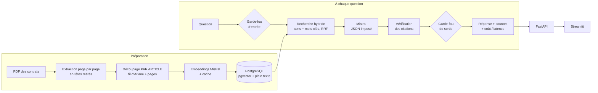

# 🛡️ Suis-je couvert ? — Assistant IA pour contrats d'assurance habitation

**Une question sur un sinistre → un verdict, les conditions, et l'article exact du contrat.
Puis la même question comparée sur plusieurs assureurs.**

Les conditions générales d'assurance habitation font 60 à 100 pages que personne ne lit.
Cet assistant **RAG** (Retrieval-Augmented Generation) les lit pour vous, **cite ses sources**
et **refuse d'inventer** : chaque citation est vérifiée automatiquement dans le contrat.

🔗 **Démo en ligne : _à ajouter après déploiement_** · 📘 API documentée : `/docs` (Swagger)

> Projet indépendant à visée pédagogique, non affilié aux assureurs cités.
> Les réponses sont indicatives : seuls le contrat et l'assureur font foi.

---

## Ce que fait l'application

| | |
|---|---|
| **Verdict** | ✅ Couvert · ❌ Non couvert · ⚠️ Sous conditions · ❓ Information absente · 🚫 Hors sujet |
| **Conditions** | Franchises, plafonds, délais, options, exclusions |
| **Citations vérifiées** | Extrait mot pour mot + section + page ; toute citation introuvable est écartée |
| **Comparaison** | Même question sur 2 à 6 contrats, traités en parallèle, tableau récapitulatif |
| **Suivi** | Latence (médiane, 95e centile), tokens et coût de chaque requête |

**Contrats analysés** : conditions générales publiques d'assurance habitation de la MAIF,
de la Macif, de la MAAF et de la Matmut ([`data/catalogue.yaml`](data/catalogue.yaml)).

## Architecture



## Résultats d'évaluation

Jeu de **40 questions** ([`evaluation/questions.yaml`](evaluation/questions.yaml)) :
25 classiques, **10 pièges** (exclusions, franchises, défaut d'entretien, absence d'effraction…)
et 5 hors sujet. Les réponses attendues sont vérifiées à la main dans chaque contrat.

**Recherche seule** (`python -m evaluation.eval_recherche`) :

| Mode | Succès à 1 | Succès à 5 | MRR |
|---|---|---|---|
| Mots-clés | _à mesurer_ | _à mesurer_ | _à mesurer_ |
| Sens (vecteurs) | _à mesurer_ | _à mesurer_ | _à mesurer_ |
| **Hybride** | _à mesurer_ | _à mesurer_ | _à mesurer_ |

**Assistant complet** (`python -m evaluation.run_eval`) :

| Indicateur | Résultat |
|---|---|
| Justesse du verdict | _à mesurer_ |
| … dont questions pièges | _à mesurer_ |
| Refus corrects (hors sujet) | _à mesurer_ |
| Fidélité des citations | _à mesurer_ |
| Latence médiane / 95e centile | _à mesurer_ |
| Coût moyen par question | _à mesurer_ |

Les rapports détaillés sont historisés dans [`evaluation/resultats/`](evaluation/resultats/).

## Choix techniques

- **Découpage par article, pas par nombre de caractères.** Une exclusion séparée de sa garantie
  fait répondre « couvert » à tort. Le découpage reconnaît les numérotations des différents
  assureurs (« 2.1 », « Article 12 », « TITRE II / Section I »), ignore le sommaire, et garde
  pour chaque passage son fil d'Ariane et ses pages.
- **Vectoriser le passage avec son contexte** (assureur + titre de section) : « sont exclus :
  les infiltrations » n'a de sens que rattaché à la garantie « Dégâts des eaux ».
- **Recherche hybride dans PostgreSQL.** Les vecteurs (pgvector) comprennent les synonymes
  (« fuite » ≈ « dégât des eaux »), le plein texte français trouve les termes exacts
  (« franchise », « vétusté »). Fusion par *Reciprocal Rank Fusion*. Une seule base pour les
  vecteurs, le texte, les filtres par assureur et le journal des requêtes.
- **Réponse en JSON validé par Pydantic**, avec une seconde chance si le format est invalide.
- **Citations vérifiées** : l'identifiant doit correspondre à un passage réellement fourni
  et l'extrait doit s'y trouver. Un verdict affirmatif sans citation valide devient
  « information absente » : mieux vaut ne pas répondre que répondre faux.
- **Économies** : question refusée ou aucun passage assez proche (seuil calibré par
  l'évaluation) → pas d'appel au LLM ; cache des embeddings pour ne jamais recalculer.
- **Les PDF ne sont pas versionnés** (ils appartiennent aux assureurs) : un catalogue + un
  script de téléchargement avec empreinte SHA-256 pour détecter les nouvelles versions.

## Démarrage rapide (Docker)

Prérequis : Docker Desktop et une clé API [Mistral](https://console.mistral.ai).

```bash
cp .env.example .env                    # puis renseigner MISTRAL_API_KEY
docker compose up -d db                 # base PostgreSQL + pgvector

# Préparation des contrats (une fois)
docker compose run --rm api python -m ingestion.download
docker compose run --rm api python -m ingestion.build_chunks
docker compose run --rm api python -m ingestion.index

docker compose up -d                    # API + interface
```

- Interface : http://localhost:8501
- API et documentation Swagger : http://localhost:8000/docs

Sans Docker pour le code Python : `python -m venv .venv`, `pip install -r requirements.txt`,
puis les mêmes commandes sans le préfixe `docker compose run --rm api`
(`uvicorn api.main:app --reload` et `streamlit run app/Accueil.py`).

## Évaluer

```bash
# 1. Annoter : afficher les passages candidats, vérifier dans le PDF, compléter questions.yaml
python -m evaluation.annoter --question q01 --contrat macif_habitation
# 2. Évaluer la recherche seule, puis l'assistant complet
python -m evaluation.eval_recherche
python -m evaluation.run_eval
```

## Tests

```bash
pytest -v
```

Les tests n'appellent ni Mistral ni la base : faux LLM, faux moteur de recherche, PDF générés.
Ils tournent automatiquement à chaque push (GitHub Actions).

## Structure

```
data/catalogue.yaml     contrats analysés (assureur, produit, lien)
ingestion/              téléchargement, extraction PDF, découpage, embeddings, indexation
rag/                    recherche hybride, prompts, génération, citations, garde-fous, suivi
api/                    API FastAPI (/ask, /compare, /contrats, /stats, /health)
app/                    interface Streamlit (question, comparaison, suivi)
evaluation/             40 questions, aide à l'annotation, scripts d'évaluation, rapports
sql/init/               schéma PostgreSQL + pgvector
docs/DEPLOIEMENT.md     mise en ligne (base hébergée, API, interface)
tests/                  tests unitaires
```

## Limites et pistes

- Seules les **conditions générales** sont analysées : les conditions particulières
  (formule choisie, options) changent souvent la réponse. Piste : laisser l'utilisateur
  préciser sa formule, ou téléverser ses conditions particulières.
- Les tableaux des PDF (plafonds, franchises) sont extraits en texte brut : une extraction
  dédiée des tableaux améliorerait les réponses chiffrées.
- Piste : ajouter un reclassement (*reranking*) des passages avant le LLM, et mesurer son apport.
